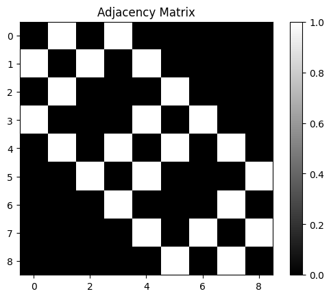
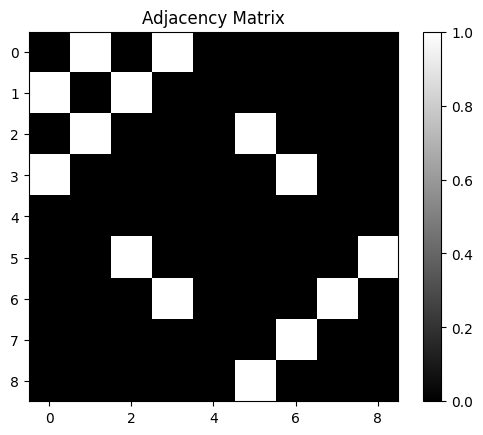
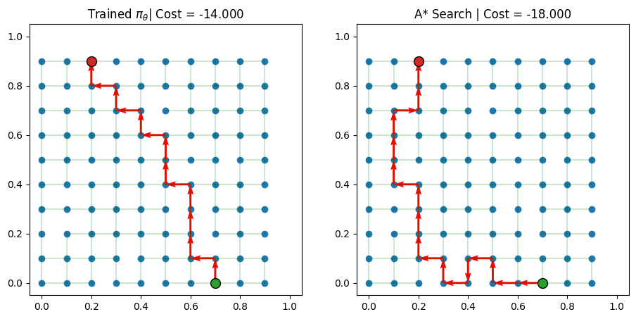
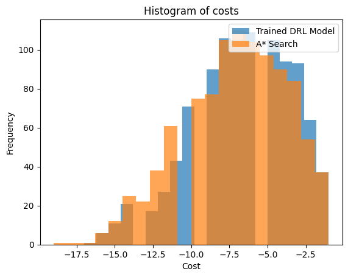
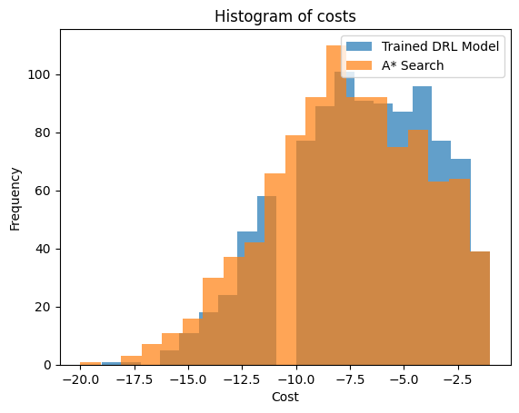

# ECE5984 Deep Reinforcement Learning AI4SPP 🚀

Welcome to our project! We're using the power of Deep Reinforcement Learning to solve the Shortest Path Problem (SPP). Our AI agent is training hard, learning from its mistakes, and getting better and better at finding the shortest path. 🧠💪

## What's Inside? 🎁

- **Deep Reinforcement Learning**: Our AI agent learns by interacting with its environment.
- **Grid Environment**: Our agent operates in a grid environment with and without obstacles.
- **Random Start and Target Nodes**: Each episode is a new challenge, with start and target nodes randomly picked.
- **Greedy Rollouts**: During the inference step, our agent performs greedy rollouts on the available actions.
- **A-Star Search Baseline**: We compare our trained policies with an A-star search baseline to confirm validity. It's like a reality check, but for AI!
- **Masking and embeddings**: Graph Neural Networks can use masking and embeddings to learn from the graph structure. We're using them to improve our agent's performance.

This is a visualistion of the mask with the graph structure, without the mask the agent would be able to see the whole graph structure, with the mask the agent can only see the nodes that are connected to the current node.


The obstacle mask is used to prevent the agent from moving through obstacles. These edges are removed from the adjacency matrix.


## Visualizations 🎨

We've made our environment observable with beautiful visualizations. Actions are shown in red, start and target nodes in green and red, and the edges in the adjacency matrix of the graph in green.



## How to Use 🚀

1. Install the required packages:
```bash
pip install rl4co
pip install torch
pip install matplotlib
```

2. Import the libraries:
```python
from SPPenv import SPPEnv
from astar import AStarSearch
from SPPembeddings import SPPInitEmbedding, SPPContext, StaticEmbedding
from SPPv2env import SPPv2Env # import the dynamic environment
```

3. The jupyter notebook 'exploration.ipynb' contains the code that was used for the submission of the project. It contains the code for the training and evaluation of the AM and POMO methods.

## Results 📊

The result histogram for the static environment.


The result histogram for the dynamic environment.



## Authors 🧑‍💻
Timo Thans (timot@vt.edu)
Sophia Rubsamen (sophiar@vt.edu)