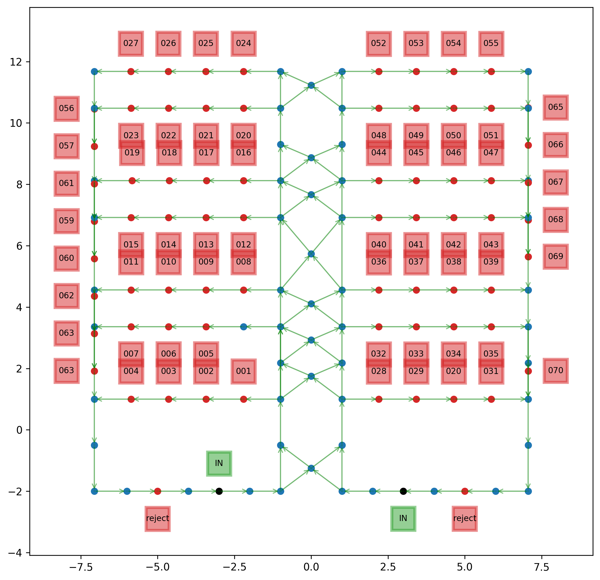
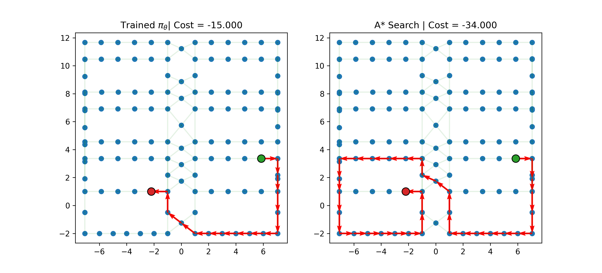

# RoboNav: Robot Path Planning Using Reinforcement Learning and Attention Models

Welcome to our project! We're using the Deep Reinforcement Learning (DRL) models to solve the Shortest Path Problem (SPP) in package sorting warehouse Floorplans. Our AI agent is training hard, learning from its mistakes, and getting better and better at finding the shortest path. 

## What's Inside? 🎁

- **Deep Reinforcement Learning**: Our AI agent learns by interacting with its environment.
- **Warehouse Floorplan Environment**: Our agent operates in the package sorting warehouse floorplan environment with nodes and connections.
- **Random Start and Target Nodes**: Each episode is a new challenge, with start and target nodes randomly picked.
- **Greedy Rollouts**: During the inference step, our agent performs greedy rollouts on the available actions.
- **A-Star Search Baseline**: We compare our trained models with an A-star search baseline to evaluate their performances.

## Visualizations 🎨

Our experimental setup consists of four robot routing problems in a warehouse, each modeled as a graph with nodes and edges. Each graph contains three types of nodes: input, target, and normal. The input node (black dot) represents a pick-up station, indicated by a green "IN" box. The target nodes (red dot) represent the drop-off points, accompanied by a red box displaying a destination number. Normal nodes (blue dots) function as connectors between neighboring nodes, creating pathways through the environment. For example, the graph layout for the Env 1 is illustrated in the figure below. 


The DRL models are compared against the baseline A* search algorithm in all four environments. To comprehensively evaluate performance, 400 runs are conducted in each environment, using random pairs of start and target nodes. A representative test run for the Env 1 was visualized below to compare the actions of the trained DRL model and the A* search algorithm,



## How to Use 🚀

1. Install the required packages:
```bash
pip install rl4co==0.3.3
pip install torch==2.3.0
pip install matplotlib
pip install numpy
pip install sklearn
```

2. Import the libraries:
```python
from FPenv import FPEnv
from SPPenv import SPPEnv
from astar import AStarSearch
from SPPembeddings import SPPInitEmbedding, SPPContext, StaticEmbedding
from SPPv2env import SPPv2Env # import the dynamic environment
from Floorplan_Codes.utils import get_paths
```

3. The jupyter notebook 'exploration.ipynb' contains the code to train the Deep Reinforcement Learning algorithms and make predictions on real floorplans. It contains the code for the training and evaluation of the AM and POMO methods.

## Results 📊

The result histogram for the static environment.


The result histogram for the dynamic environment.


The results of real floorplan predictions can be found in the last cell of 'exploration.ipynb'.

## Authors 🧑‍💻
Yifei Zhou (y.zhou@primevisiontechnology.com)
Timo Thans (timot@vt.edu)
