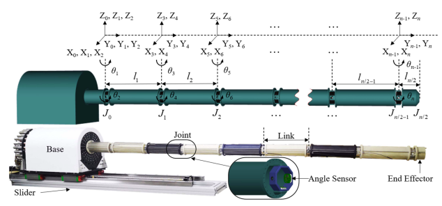

# Deep Reinforcement Learning and Enhanced Pathfinding in Robotic Navigation
> **Abstract**:

> **Introduction**:
> - Real-world application:
>   - Better technical image of robot with workings of the robot
> 
>   - Better explanation of the environment and problem statement
> 

> **Technical Strengths**:
> - Attention Model Mechanism (can we display the attention mechanism?)
>   * How are our embeddings setup?
> - REINFORCE and POMO: better and more original explanation focusing on our application
>   * How is our policy and reward function setup?
>   * Needs a diagram
>   * Section 2.4 needs to be written clearly

> **Experiments**:
> - handfull of environments (excluding the gridworld)
> - Train model on each environment individually and export the model
>   * Display the training process
>   * Store the models in git
> - Test the model on each environment individually:
>   * Performance metrics:
>       - Success rate
>       - Average steps to goal
>       - Turns taken

> **Drafting**:
> - Latex Template (page limit?)
> 